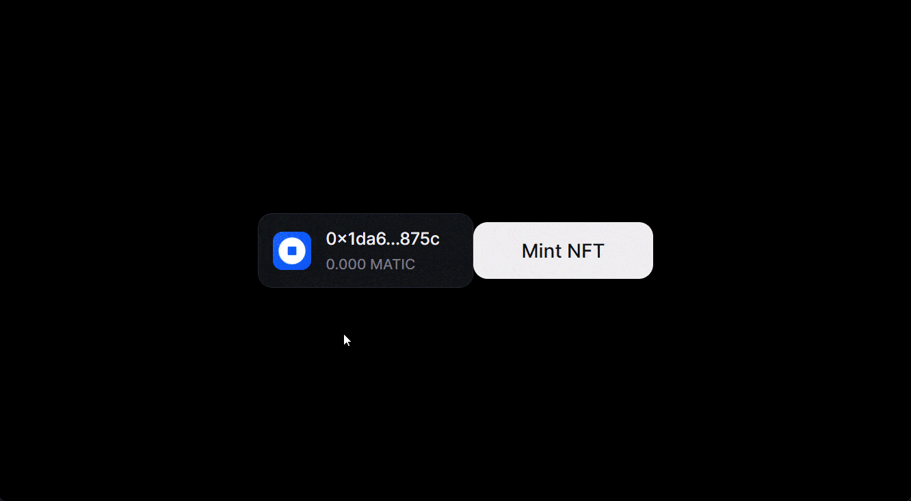

<h1 align="center">
  Polygon 💜🤝 Coinbase Smart Wallet
</h1>

<p align="center">
  Sponsor Coinbase Smart Wallet transactions with paymasters on Polygon Proof of Stake chain. 
</p>

<p>
<ul>
    <li>🔗 Connect to the application via Coinbase Smart Wallet.</li>
    <li>💸 Perform transactions from your newly created wallet.</li>
    <li>🚫 Pay no gas fees! Thanks to the power of paymasters to cover user's gas fees.</li>
</ul>
</p>

<p>
<a href="https://polygon-coinbase-smart-wallet.vercel.app/" target="_blank">Try the Live Demo</a>!
</p>

<figure align="center">
  
  <figcaption align="center">
    <a href="https://polygon-coinbase-smart-wallet.vercel.app/" target="_blank">Try the Live Demo</a>!
  </figcaption>
</figure>

## Using this Repository

I have written a full tutorial on how to build this application from scratch. [Read the tutorial](TODO)!

To get started locally:

1. [Clone](https://docs.github.com/en/repositories/creating-and-managing-repositories/cloning-a-repository) this repository.

2. Install dependencies with `pnpm install`.

3. Create a [thirdweb API key](https://docs.github.com/en/repositories/creating-and-managing-repositories/cloning-a-repository) on the thirdweb dashboard.

4. Create a `.env.local` file in the root of the project and add the following: `NEXT_PUBLIC_THIRDWEB_CLIENT_ID=your-thirdweb-client-id-goes-here`.

5. On the [page.tsx](./src/app/page.tsx) file, set what chain you want to use (from the list of [supported chains](https://www.smartwallet.dev/FAQ#what-networks-are-supported)). **Note**: You need to add a **credit card** to your thirdweb account _if_ you want to use mainnet chains. To use testnets such as `baseSepolia`, you don't need to add a credit card.

   ```tsx
   // The default is polygon mainnet, which requires a credit card on your thirdweb account.
   import { polygon } from "thirdweb/chains";
   const chainToUse = polygon;
   ```

6. For mainnet use, configure [paymaster rules](https://thirdweb.com/dashboard/connect/account-abstraction) on the thirdweb dashboard.

7. Run the application with `pnpm run dev` and visit http://localhost:3000/ in your browser.

### Devs do something

Reach out to me on Twitter [@jarrodwattsdev](https://twitter.com/jarrodwattsdev) or open an issue on this repository for any questions or feedback.
